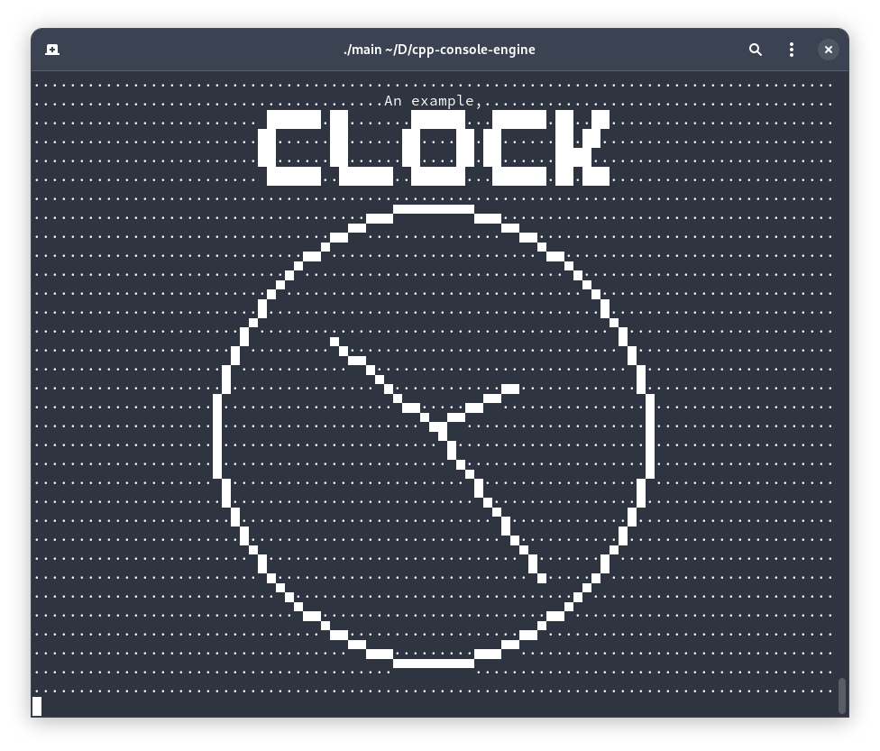

# CPP-CONSOLE-ENGINE
Allows drawing simple 2D pixels, lines and circles to a terminal.

# Feautures
Currently the project has implemented:
 - support drawing text
 - support turning pixels on and of where each pixel is a mostly perfect square
 - support drawing lines
 - support drawing circles

# Roadmap
Currently the project plans to implement the following:
 - support colour
 - support terminal screen changing size
 - support keyboard and mouse input
 - support 3D

# Lifecyle
This is the lifecycle of screens
 - Create screen
 - Set/delete pixels
 - Draw text
 - Print screen
 - Clear screen
 - Dispose of screen (no way to currently do)
